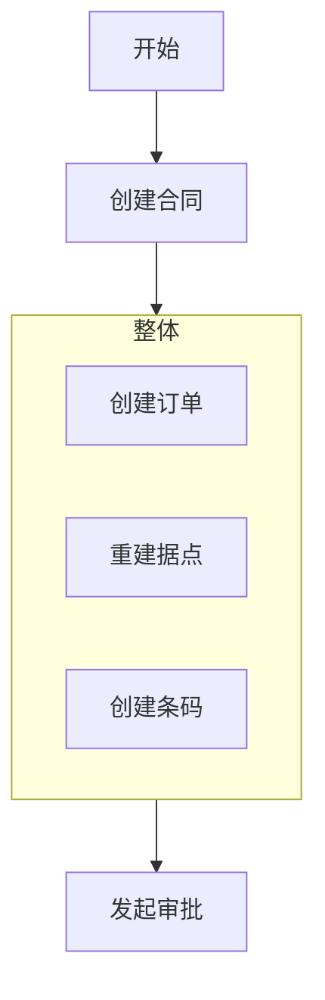

```javascript
npm i docsify-cli -g
```

## Linux下后台部署项目

在Linux下如果使用下面的命令启动docsify，会发现一旦关闭了xShell，那么就访问不了了，具体问题还不清楚，下面说种可以在后台运行的方法；

```shell
nohup docsify serve 项目地址 --port=80 > /dev/null 2>&1 &
```

通过编写shell脚本，将上面代码放到脚本里面，再启动就可以了；
1、创建脚本：vim start_docsify.sh

```shell
#! bin/bash
nohup docsify serve 项目地址 --port=80 > /dev/null 2>&1 &
```

2、启动脚本

```shell
bash start_docsify.sh
```

## 基础配置项（index.html）

> 下面是一份基础的配置项模板如下(可直接Copy使用)。

```html
span
```

```markdown
## 业务大叔大婶

业务1111111111
```

```sql
SELECT column1, aggregate_function(column2)
FROM table_name
GROUP BY column1
HAVING condition;
```

## 封面配置文件（_coverpage.md）

> [Docsify官网封面配置教程](https://docsify.js.org/#/zh-cn/cover)

> [!NOTE]
> An alert of type 'note' using global style 'callout'.

> [!TIP]
> An alert of type 'tip' using global style 'callout'.

> [!WARNING]
> An alert of type 'warning' using global style 'callout'.

> [!ATTENTION]
> An alert of type 'attention' using global style 'callout'.

<!-- tabs:start -->

#### **English**

Hello!

#### **French**

Bonjour!

#### **Italian**

Ciao!

<!-- tabs:end -->

### Section X

```plantuml
span
```
### Section X




This is a simple plugin which gives you a flexible two-column layout via a custom markdown syntax.This is a simple plugin which gives you a flexible two-column layout via a custom markdown syntax.

<!-- slide:break -->

This is a simple plugin which gives you a flexible two-column layout via a custom markdown syntax.
This is a simple plugin which gives you a flexible two-column layout via a custom markdown syntax.This is a simple plugin which gives you a flexible two-column layout via a custom markdown syntax.
This is a simple plugin which gives you a flexible two-column layout via a custom markdown syntax.

<!-- slide:break-# -->

